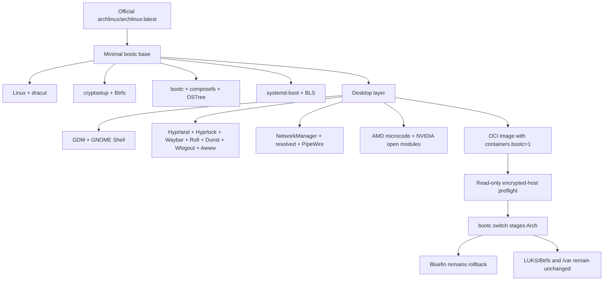

# Minimal Arch bootc architecture

The base is intentionally derived from the
[`bootcrew/mono` Arch design](https://github.com/bootcrew/mono/tree/main/arch),
including its isolated bootc build stage, relocated pacman state, generic
dracut build, bootc rootfs symlinks/tmpfiles, and composefs configuration.
Host-specific additions are limited to LUKS/Btrfs coverage, GNOME/GDM,
Hyprland desktop tooling, NetworkManager with systemd-resolved, AMD microcode,
and the open NVIDIA kernel modules.

## Safety model

- The live machine is already a composefs/UKI bootc system.
- Its physical root is Btrfs inside the unlocked LUKS mapping
  `/dev/mapper/root`.
- The migration uses `bootc switch`, not a disk installer.
- The switch is staged without `--apply`; reboot is a separate manual gate.
- Disk, partition, filesystem, and LUKS labels are never rewritten.
- `/var`, including `/var/home/bupd`, remains persistent.
- The current Bluefin image remains the rollback deployment and boot menu
  entry.
- The composefs boot and bootloader implementation is unchanged between the
  host's bootc 1.16.2 and the image's 1.16.6; the only deployment-path diff is
  an internal kernel-command-line crate rename.
- Secure Boot must remain disabled until a signed Arch UKI workflow is added.

## Image policy

- Official Arch packages by default for the operating system and desktop.
- Bootc is built from its upstream release because Arch has no official bootc
  package; its build dependencies do not remain in the final image.
- No Flatpak runtime or remotes.
- `yay-bin` and `wlogout` are explicit AUR exceptions for the Hyprland desktop
  layer.
- No additional AUR packages without documenting them here and in the README.
- No `swww` until the image policy permits another AUR exception or an
  official package becomes available.
- No curl/npm application installers.
- No dotfiles or credentials.
- No custom MT7902 driver, module option, or fallback payload.
- No custom ESP synchronization binary, boot-loader service, or first-boot
  helper; upstream bootc owns deployment, finalization, and rollback.
- No custom ESP or boot-entry inspection path; bootc exclusively owns the
  systemd-boot lifecycle.
