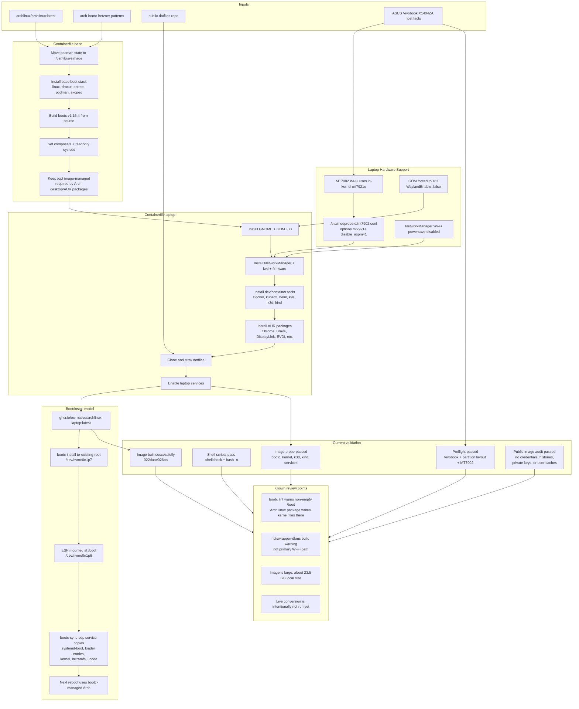

# Arch Linux Laptop bootc Architecture

## Decision Notes

- The image keeps `/opt` as image-managed because Arch desktop/AUR packages install package-owned payloads there, especially browser, DisplayLink, and Intel/PyTorch dependencies.
- The primary Wi-Fi support is the stock kernel `mt7921e` driver with `disable_aspm=1`; experimental DKMS/ndiswrapper artifacts are documented only as fallback notes.
- The install path is scripted but intentionally guarded. It validates the ASUS model, partition layout, and explicit confirmation before `bootc install to-existing-root`.
- The ESP sync service exists because the Arch `linux` package writes kernel artifacts into `/boot`, which differs from stricter bootc base-image expectations.
- The public-image audit preserves installed AUR packages while excluding package build caches, shell histories, SSH material, personal Git identity, private keys, and credential-like content.
