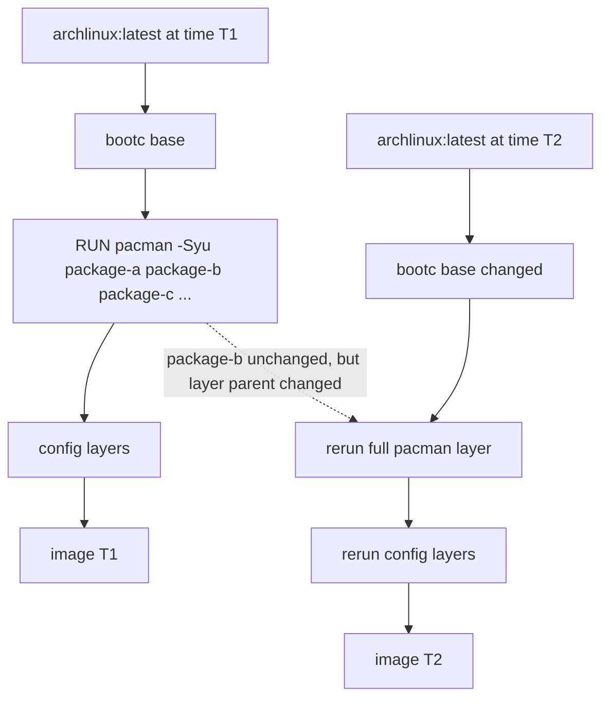
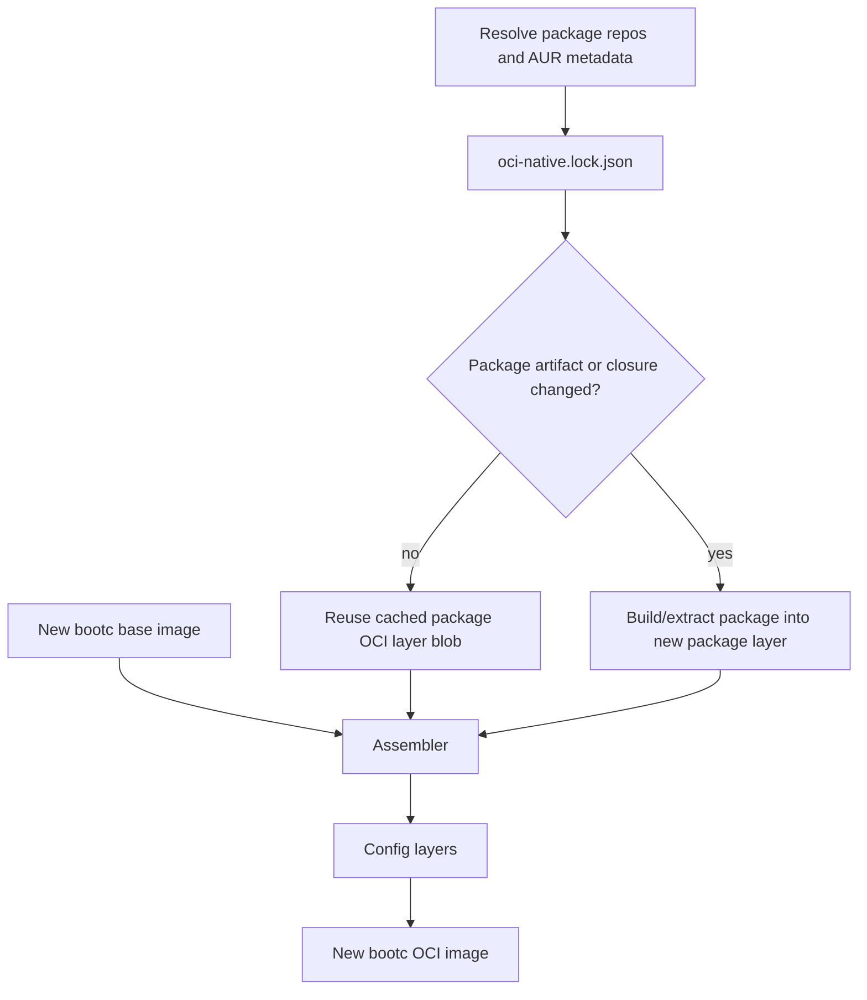
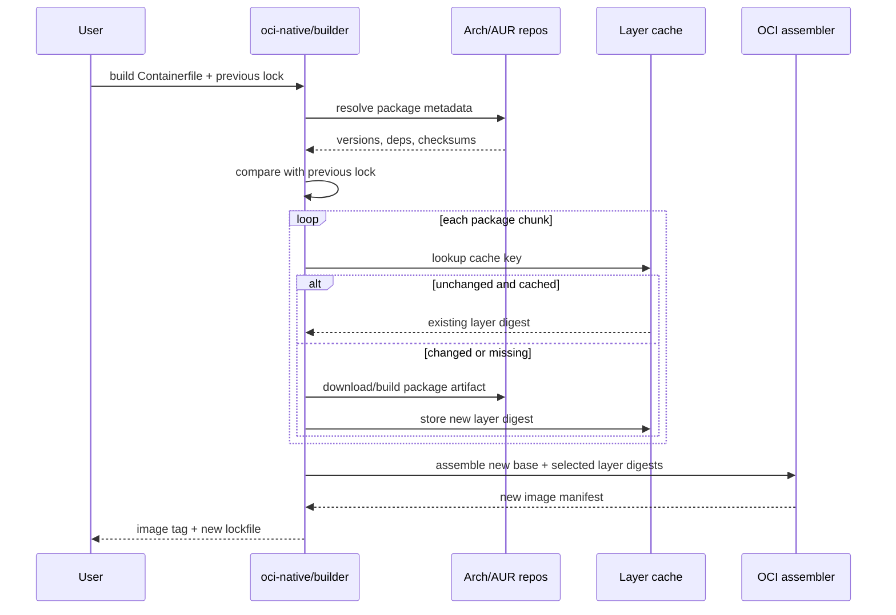

# oci-native/builder plan

## Goal

`oci-native/builder` should build bootc OCI images like a package-aware
assembler, not like a command replay engine.

The current Dockerfile/Podman cache model treats a changed parent layer as a
reason to rerun every later `RUN` instruction. That is correct for arbitrary
shell commands, but wasteful for package installation. If a package artifact is
byte-for-byte unchanged, rebuilding or redownloading it only because the base
image changed is unnecessary compute and bandwidth.

The builder should instead:

- resolve package artifacts and checksums before building;
- compare the new package graph with the previous build history;
- rebuild only packages whose artifact, dependency closure, install scripts, or
  builder transform changed;
- reuse unchanged package layers by assembling their existing OCI layer blobs on
  top of the new base;
- produce a new image manifest even when most reused layer blobs are old.

This is closer to a Git rebase of binary commits than to Dockerfile cache
replay.

## Current problem



The final filesystem may contain the same `package-b` bytes, but normal build
cache cannot know that from the Dockerfile command alone. It sees a different
parent filesystem and reruns the command.

## Desired model



The parent image can change while unchanged package layer blobs are reused.
The output image digest changes, but unchanged layer blobs do not need to be
recreated or downloaded again.

## Package lock

The builder should maintain a lockfile, for example
`oci-native.lock.json`, containing one resolved record per package:

```json
{
  "repos": {
    "arch": {
      "snapshot": "2026-07-30T00:00:00Z",
      "server": "https://archive.archlinux.org/repos/..."
    }
  },
  "packages": {
    "waybar": {
      "source": "pacman",
      "repo": "extra",
      "version": "0.14.0-1",
      "arch": "x86_64",
      "pkg_sha256": "...",
      "depends": ["glibc", "gtk-layer-shell", "jsoncpp"],
      "install_script_sha256": null,
      "layer_digest": "sha256:..."
    },
    "hyprmod": {
      "source": "aur",
      "version": "0.4.0-3",
      "pkgbuild_sha256": "...",
      "built_pkg_sha256": "...",
      "depends": ["python", "gtk4", "libadwaita"],
      "layer_digest": "sha256:..."
    }
  }
}
```

The lockfile is the builder's equivalent of Git commit metadata. It explains
why a layer can be reused or why it must be rebuilt.

## Cache key

Each package layer should be keyed by:

- package name;
- package version and release;
- package archive checksum;
- dependency closure fingerprint;
- install script checksum, if present;
- builder transform version;
- target architecture;
- relevant pacman configuration fingerprint.

If the key is unchanged, the builder reuses the existing layer blob.

If the package bytes are unchanged but the dependency closure changed, the
builder should be conservative and rebuild or revalidate that package layer.

## Layer strategy

Do not create an unbounded number of layers by default. OCI allows many layers,
but registries, overlay mounts, and runtime tooling behave better with a
controlled graph.

Recommended compromise:

- one layer per volatile package or AUR package;
- grouped layers for boring, stable package sets;
- final config layers kept very late;
- initramfs and bootc validation after all package assembly.

Example:


For very fast iteration, the highest churn packages and config should be near
the end of the image.

## Build algorithm



## Pacman state

This is the risky part.

Arch packages do not only copy files into `/usr`. They also affect pacman local
database state, hooks, install scripts, file ownership, conflicts, and dependency
metadata. The builder must not blindly reuse arbitrary `RUN pacman ...` output.

The safer approach is:

- build package layers from actual `.pkg.tar.zst` artifacts;
- include the package's pacman local database entry in the same logical layer;
- run package install scripts and hooks in a controlled phase when required;
- track hook inputs as part of the cache key;
- run final validation against pacman's database and filesystem ownership.

If this is too much for v1, start with a narrower scope:

- support official repo packages without complex hooks;
- treat kernel, initramfs, DKMS, NVIDIA, systemd, and bootc-sensitive packages
  as always-rebuild chunks;
- handle AUR packages as isolated late layers.

## Arch repo freshness

There are two modes:

### Fast mode

Fast mode reuses the currently pinned repo snapshot and lockfile.

- no full `pacman -Syu`;
- no base refresh unless requested;
- only changed package declarations or config layers rebuild;
- target: sub-minute config builds and 2-5 minute package edits.

### Refresh mode

Refresh mode intentionally moves the base and package universe forward.

- pull latest base image;
- refresh Arch package databases;
- update the lockfile;
- rebuild only package layers whose resolved artifact or closure changed;
- run full bootc/initramfs validation.

Refresh mode is the equivalent of rebasing a branch onto a new upstream.

## Containerfile frontend idea

The user-facing file can stay Dockerfile-like, but package installation should
be expressed as declarative package chunks instead of opaque shell commands.

Example sketch:

```Dockerfile
FROM docker.io/archlinux/archlinux:latest

PKGCHUNK boot linux linux-firmware-realtek amd-ucode nvidia-open nvidia-utils
PKGCHUNK hypr hyprland hyprlock waybar rofi dunst awww
PKGCHUNK fonts ttf-jetbrains-mono-nerd noto-fonts noto-fonts-emoji
PKGCHUNK bluetooth bluez bluez-utils blueman bluetui

AURCHUNK hyprmod hyprwhspr-git wlogout

RUN dracut --force "$(find /usr/lib/modules -mindepth 1 -maxdepth 1 -type d | sort -V | tail -1)/initramfs.img"
RUN bootc container lint --fatal-warnings
```

`PKGCHUNK` and `AURCHUNK` are not Dockerfile instructions. They are an
`oci-native/builder` frontend concept that compiles into package-aware OCI
layers.

## MVP

1. Create a package resolver that writes `oci-native.lock.json` for official
   Arch packages.
2. Download packages into a content-addressed package cache.
3. Convert package archives into deterministic OCI layer blobs.
4. Assemble a bootc image from:
   - selected base layers;
   - cached package layers;
   - config layers;
   - final initramfs/lint layer.
5. Add AUR support as late isolated chunks.
6. Add refresh mode and fast mode.
7. Add validation:
   - pacman database consistency;
   - missing shared libraries;
   - bootc lint;
   - initramfs contents;
   - selected package presence.

## Non-goals for v1

- perfect support for every pacman hook;
- arbitrary `RUN` command rebase;
- layer reuse across incompatible architectures;
- pretending unchanged package layers are safe when their dependency closure
  changed;
- replacing pacman as the source of truth for dependency resolution.

## Open questions

- Should package layers be one package each, or grouped by dependency closure?
- How should pacman hooks be represented in the lockfile?
- Which packages are boot-critical enough to always rebuild together?
- Should the builder pin to Arch Linux Archive snapshots by default?
- Can `bootc` consume the assembled image without any extra annotations beyond
  standard OCI labels and filesystem layout?
- How much validation is required before allowing a cached package layer to be
  reused across a changed base?
